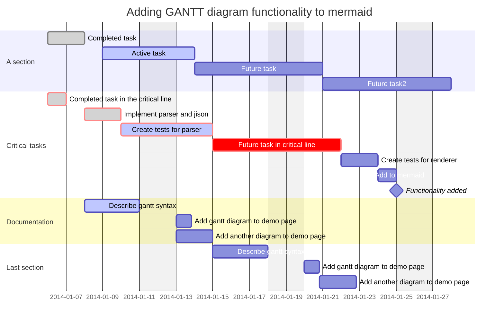

| 版本   | 时间        | 修改人 | 备注  |
|------|-----------|-----|-----|
| V1.0 | 2022.9.22 | 聂向南  | 初始化 |

## 1.需求背景

### 1.1.需求概述

> 相关PRD以及介

1. 需要支持图片上传，
2. 需要支持标题和内容多都可以传,标题可以为空，最多20个字，内容不能为，最多支持1000个字
3. 需要支持话题，话题可以支持搜索，搜索排序需要接入算法
4. 需要支持@用户功能，用户关联首先给用户关注的人和关注我的人，其次支持搜索
5. 需要支持自定义表情
6. 需要支持POI地点位置
7. 需要做权限设置，支持公开和私密两种
8. 支持定时发布功能

### 1.2.需求干系人

| 人员   | 项目角色 |
| ------ | -------- |
| 聂向南 | 研发     |

### 1.3.技术目标

| 场景     | 目标       | 备注          |
|:-------|----------|-------------|
| 上传成功率  | 99.99%   | 依赖于对象存储的成功率 |
| 发布成功率  | 99.99%   |             |
| 发布时间耗时 | 95分位30分钟 |             |

### 1.4.术语

| 术语 | 定义 | 备注 |
|----|----|----|
|    |    |    |

## 2.需求分析

### 2.1.用例分析

> BDD模式,用于场景故事,用例分析需要include相关文档

整个需求在业务上一般有4个部分组成,分别是上传,管理,处理,分发.我们拿阿里的视频云链路流程举例

1. 上传,在设计上我们一般不接入他的SDK,通过自身的BUCKET来管理,在通过注册来完成媒体资料的信息
2. 需要支持通过PCWEB和客户端上传相关文件,并存储到相应的位置上来,我们接入的时候
3. 管理,需要对音视频和图片文件进行有效的管理,也可以对相关素材进行管理
4. 处理,需要对音视频&图片进行转码,以降低文件大小提升清晰度等,智能分类,视频截图，字幕挂载等操作
5. 分发,主要是内容对用户展示,其中主要是是安全和播放质量监控以及相关CDN辅助分发能力

### 2.2.约束和限制

| 约束和限制 |                      条件                       |
| :--------: | :---------------------------------------------: |
|    时间    |                                                 |
|    成本    |                                                 |
|    安全    |               需要注意防资产损失                |
|    合规    |         敏感数据和隐私数据如何保证合规          |
|    技术    | 目前团队主要研发人员是 Java，最好用 Java 开发。 |
|    兼容    |          业务上需要历史老接口,需要兼容          |

### 2.3.复杂度分析

#### 2.3.1.可用性分析

> ### 系统可用性的度量
> 
> | 可用性级别 | 系统可用性% | 宕机时间/年 | 宕机时间/月 | 宕机时间/周 | 宕机时间/天 |
> | :--------: | :---------: | :---------: | :---------: | :---------: | :---------: |
> |   不可用   |     90%     |   36.5 天   |   73 小时   |  16.8 小时  |  144 分钟   |
> |  基本可用  |     99%     |  87.6 小时  |  7.3 小时   |  1.68 小时  |  14.4 分钟  |
> |  较高可用  |    99.9%    |  8.76 小时  |  43.8 分钟  |  10.1 分钟  |  1.44 分钟  |
> |   高可用   |   99.99%    | 52.56 分钟  |  4.38 分钟  |   1.01 秒   |   8.64 秒   |
> |  极高可用  |   99.999%   |  5.26 分钟  |  26.28 秒   |   6.06 秒   |   0.86 秒   |

1. 容量预估:
    1. 10亿注册用户,2亿DAU,人均发布50个帖子,其中90%的帖子是视频,单帖子15M,10%是图片,处理前图片300K,处理后单图片大概100K,人均10张图片,单帖子在3M左右，人均发布转化率在3%,人均日发送1.5个,视频大体时长在15S左右,大小在15 * 2Mbps/8=3.75M
    2. 我们预计当前帖子数在30亿,每日新增2亿* 0.03 *1.5=900W,按照1000W计算,未来预期容量10亿 * 50=500亿条,
    3. 当前视频存储30亿*3.75M/1024/1024=10.48P,每日新增存储在1000W *3.75M/1024/1024=35T,未来预期存储大小500亿 * 3.75M/1024/1024/1024=174P
    4. 当前每日视频总时长在15S*1000W/60=2500000分钟=1736.12天时长,一年15S * 1000W*365=633680.55天.
    5. 当前每日1000W*0.1=100W个图片贴,共有图片100W * 10=1000W张图片,总大小在100W * 5M=35T
    6. 我们一般会要在转码过程中每1S截一次图同时存下来用于预览和缩略图以及视频索引和标记等,1000W *0.05 * 15/1024/1024=7.15T
2. 业务高可用,对于投稿应用来讲,是整个商业系统的核心,因此必须保证,文件上传的高可用,帖子写入的高可用,帖子存储的高可用,帖子读取的高可用.

#### 2.3.2.性能分析

1. 性能预估
    1. 系统写入TPS预估:1000W/3600/24=115,峰值计算:1000W * 0.8/3600/24/0.2=462TPS,为了预留一定的系统容量应对峰值,将目标设定为峰值的5倍，462*5=2310TPS
    2. 系统读取流量预估,峰值QPS整体按照10倍预估
       1. 首页帖子FEED流量预估,2亿* 6(一天打开6次)* 3(平均下查3个请求)/3600/24=41666，峰值=平均*10=41.7WQPS
       2. 用户在首页的跳出率是20%的话,其他业务流量41.7W*0.25=8.34W.下拉列表两次2次=8.34W *2=16.68W
       3. 因为是社区的基础数据业务,会被其他业务频繁的访问,因此需要预留和主场景一样的流量,41.7W.
       4. 因此41.7W+16.68W+41.7W=100W
    3. 通过以上分析, 我们可以推断出投稿系统是个读多写少的业务.
1. 分发预估
    1. 平均QPS在41666,一般会预先加载3个,在3秒中加载完成,平常峰值是2倍=10W
    2. 图片预估:图片大小在JPG或者webp下大概在于50KB左右， 10万 * 0.05  * 8 =80000Mbps
    3. 视频预估:视频大小在3.75M 10万 * 3.75*  8 =3000000 总带宽3100000Mbps
    4. 95峰值:3100000Mbps* 5  * 60* 0.95/1024= 842.6Tbps

#### 2.3.3.扩展性分析

>
可扩展性是指,系统为了应对将来需求变化而提供的一种扩展能力，当有新的需求出现时，系统不需要或者仅需要少量修改就可以支持，无须整个系统重构或者重建。由于软件系统固有的多变性，新的需求总会不断提出来，因此可扩展性显得尤其重要。在软件开发领域，面向对象思想的提出，就是为了解决可扩展性带来的问题；后来的设计模式，更是将可扩展性做到了极致。得益于设计模式的巨大影响力，几乎所有的技术人员对于可扩展性都特别重视。设计具备良好可扩展性的系统，有两个基本条件：正确预测变化,完美应对变化

1. 从内容的实际载体来看,业务现在支持图&视频,未来可能其他实体类型,比如只有音频因此需要支持其他业务实体的扩展,如只支持音频或其他
2. 针对除了内容本身外, 需要支持对内容的用户侧打标,如现有的话题,POI,权限,未来可能还要支持其他的打标能力
3. 在发布者端除了基础的运营能力,如置顶,未来还有可能出现合集等能力,

#### 2.3.4.成本分析

图片是某短视频网站的的收入成本,其中服务器和带宽占比大概是8%左右,DAU在3.5亿左右情况下,服务器和带宽成本大体在66.23693亿，若我们DAU在2亿左右,成本大体上有37.85亿,单月成本大概在3.15亿,假设机器成本在1亿左右,单月成本大体在2.65/12=1791W 具体带宽成本需要和各大云服务商聊,云运营商网络服务费自身有很大的利润空间,一般对于内容的处理大体分3个阶段,生产,存储,分发.

##### 2.3.4.1.生产

生产成本一般是视频转码和智能审核的成本

1. 转码费用主要受视频时长,输出分辨率,转码格式(H264/H265)等因素影响,一般为FFmpeg的CPU密集型任务,所以成本一般和机器成正比.
2. 转码过程中我们一般会要截图用于预览和缩略图以及未来用于视频索引和标记,大体上一般1S会截取一张图,并存储起来,这里也有一定的存储成本
3. 智能审核大体是采取先抽帧生产出图片再利用图片安全算法来进行审核的技术,一般和视频长短直接相关,和分辨率,格式,视频清晰度没有关系。

##### 2.3.4.2.存储

存储大体是对象存储的成本,一般我们为了保证冗余一般我们需要开启多地多桶,单桶同城冗余的模式来保证数据的安全性,其成本和存储文件的大小规模有关

##### 2.3.4.3 分发

分发成本一般为对象存储的流量成本和CDN的带宽成本,一般这是视频网站或者设计网站的大头

1. 流量费用一般是95峰值收费和流量收费,我们一般取按95峰值收费,其中对象存储成本一般是CDN回源成本和直接下载的成本.
2. 在短视频中, 大体上会产用H264和H265的两种码率,其中H265比264大约会带来20%到30%的码率节约,一般H264时默认的编码方式,视频如果播放量比较大的情况下可产用H265,有利于降低分发成本.
3. 分发其实是个下载视频文件的过程,传统下载是网站链接下载或者p2p下载,因此也可以利用p2p模式有效的降低带宽费用,单坏处可能下载需要做更好的容错性.

##### 2.3.4.4 人力

谈完技术成本后,我们还需要考虑在其中比较重要的人工审核人力成本,随着视频越来越多, 政策对安全合规,隐私的保护会越来越重视,因此需要大量的人力做机器审核完做人力审核。

#### 2.3.5.其他

1. 212
2. 2121

 总体分析下来我们要重点考虑的点是高性能的帖子读取,高可用的文件上传,高可用的帖子发布,高可用的帖子存储,高可用的帖子读取,有安全的帖子发布.

## 3.概要设计

> 列出3-5个备选方案供大家参考,备选方案的差异要比较明显,备选方案的技术不要只局限于已经熟悉的技术

### 3.1.领域设计

> 可参考[C4_Model](https://c4model.com/)  使用C4-plantuml绘画,领域模型一般商业逻辑不变的话,基本也不变

 )

### 3.2.架构选型

#### 3.2.1.接入阿里视频云

1. 整体能力比较丰富,能有的基本都有了从客户端上传到管理,转码,审核再到分发最终到客户端播放SDK基本是一个端到端的解决方案.
1. 存储管理可通过PAAS自带的OSS BUCKET或者绑定已经有的BUCKET来处理,但需要通过注册接口将元数据写入进去具体链接https://help.aliyun.com/zh/vod/user-guide/manage-vod-storage-1
1. 上传管理可以在客户端通过SDK直接接入也可以通过服务端直接接入.
1. 转码管理可以通过工作流的方式在上传后直接触发,触发的配置模版过程也可以编辑，自动安检审核也是在工作流上可以自动编辑.
1. 同时客户端播放器SDK也可以接入,相关的播放分析也可以来将相关metric来完成.

##### 3.2.1.1.成本

1. 转码成本

   

   1. 从图上我们可以看出在都是720P的情况下,H265是H264的5倍,窄带高清是正常转码单价的3倍,窄带高清正常可以可以节省20-40%的码率.
   2.  在选择720P,H264下,单日成本大概在2500000(分钟)*0.0326=81500,若使用窄带高清是81500 * 3=255000CNY,2.0大该是5倍=255000*5=1275000.
   3. 在选择时候一般是根据规则来进行选择转码, 在分发量比较大的视频上我们选择窄带高清H265能更节省我们的分发资源，因此是个计算平衡的过程整体按照基本窄带高清,一些H265来计算大体=350000,月估计350000* 30 * 0.5=525万

2. 审核成本

   

   1. 从图上我们可以看出,一般我们要黄,爆,后续可以进行添加新的功能或者根据不同的视频走不同的视频审核模版
   2. 费用上2500000 * 0.07 =175000,月估计=17.5万 * 30 * 0.5=262.5万

   

3. 图片转码&截图

   

   1. 每张图片需要压缩成 低和中两种格式，费用1000W*0.025/1000 + 1000W * 0.1/1000=1250*30=1.875万
   2. 每种图片需要转换成JPG和WEB P的格式，因此需要( 5 * 35T * 30 -10T) * 1024 * 0.025 *0.5=6.7万
   3. 正常视频转码大概 1000W *15(秒) /1000 *0.1 * 0.5=7500左右
   4. 总成本=6.7+0.75+1.875=9.325万

4. OSS成本

   

   1. 我们一般采取同城冗余存储,提高数据的安全性,在历史中我们一般会将比如3-5年前的视频进行一定的归档处理,具体处理多少会跟随业务规划,因此存量成本是0.15CNY, 0.15 * 30亿*3.75M/1024=1647950,增量成本=35 * 1024 * 0.15 * 30 * 0.5=8.064万 ,截图成本=7.15*  1024 *  0.15 * 30* 0.5月存储费用=1.647万 共9.7W，
   2. 上传到OSS虽然在这里看起来免费,但为了能让视频上传的更快会开通加速地址，加速的地址的价格为0.5/G，在转码过程中需要将文件下载到转码机器上一般机器是在内网,内网流出是免费的，但转码完后需要重新上传到OSS上,这个过程也是内网流入的，因此若我们打开加速地址 35*1024(一天大小) * 0.5*30 * 0.5 =26.8万,这个地址,这个地址其实可以针对某些大V开启,针对普通可以完成降低,因此我们按照10% 计算，大体=2.68W
   3. CDN回源费用,一般资源文件我们不会更改,视频大体是比较热的数据,回源主要看命中率,按照分发比例若命中率在99.7以上,因此只需要0.2%回源,月 10万 * 3.75 * 0.003 * 60 * 60 * 24*30/1024 * 0.5=142.4万
   4. 总成本=9.7+2.68+142.4=154.78W

5. CDN成本

   

1. 若我们按照峰值计费3100000Mbps*0.54 * 0.5*30==25110000,按照95峰值计算,需要和云运营商商谈价格,可能会便宜一些,和我们预估不相上下.

总体成本 525+262.5+9.325+154.78=951.605万 带宽成本需要聊

##### 3.2.1.2 可靠

##### 3.2.1.3.性能

##### 3.2.1.4 安全

#### 3.2.2.接入火山视频云

1. 从整体能力来看,上传,管理,转码,审核,截图,播放质量统计基本都有,但审核没有集成进去，需要和veImageX产品结合才能，整体更偏向短视频

##### 3.2.2.1.成本

1. 转码成本

     

   

   

   

   

   

   

   

   

   

   

   

   

   1. 从图上我们可以看出在都是720P的情况下,和阿里云的定金基本一致,720P H264=0.0325,但在极智超请下价格0.0981>阿里云的0.0978,H265的价格720P和1080P一下下一样

2. 审核成本

   火山云是没有视频审核这个功能的,但可以通过视频截图来接入veImageX来完成,但依赖我们的视频截图来完成

   

   1. 1000W *15(秒) /1000 *1.1 * 0.5*30=247.5万

3. 视频截图

   

   1. 在价格上和阿里云基本一样

4. 存储成本

   

   

   1. 一般存储成本还是还是按照多AZ来计算，存储成本和阿里云一样, 单价都是0.15.和阿里云一样
   2. 公网流入成本免费,但无加速地址,因此体验上可能会有损,但无成本
   3. CDN回源成本大体也和阿里云一样0.15/G。成本一致
   4. 总成本=9.7+142.4=152.1W

5. CDN成本

   

   1. 总带宽=3100000Mbps/8/1024 * 60 * 60 * 24 * 0.15*0.5=2452148,但需要联系商务走95峰值.

   总成本= 525+247.5+9.325+152.1=933.925 带宽成本需要聊,但一些能力上有缺失

##### 3.2.2.2 可靠

1. 

##### 3.2.2.3.性能

1. 

##### 3.2.2.4 安全

1. 

4. 

#### 3.2.3.自研+接入PAAS

> 需要画图

当我们选择两者结合的时候,也意味着链路会变得极其复杂.但又同时有了极大的自主性,整体设计来看就是抓住客户端的SDK,使得服务端中间组件可替换,

1. 上传需要调研自研和PAAS需要如何接入,以支持统一的上传SDK

   1. 因为PAAS自身可通过自定义BUCKET接入,因此可以利用该能力将上传功能收拢到自身,从而完成入口的统一

2. 媒体处理结合

   1. 需要创建自身的工作流体系,通过自身的工作流体系来完成相关媒体处理链路,如是选择A链路还是选择B链路
   2. 同时也可以将任务从在两者中做相关切换,这样可以带来巨大的弹性能力 

3. 分发体系结合

   1. 和多家云厂商建立沟通从而完成自身CDN体系的覆盖
   2. 自身研发SDK测相关功能从而完成链路的完整闭环

4. 在测试测需要和播放SDK完成完整的数据链路闭环,从而提升业务的稳定性

#### 3.2.3.架构评估

> 列出我们需要关注的质量属性点，然后分别从这些质量属性的维度去评估每个方案，再综合挑选适合当时情况的最优方案。常见的方案质量属性点有：性能、可用性、硬件成本、项目投入、复杂度、安全性、可扩展性等。在评估这些质量属性时，需要遵循架构设计原则
> 1“合适原则”和原则 2“简单原则”，避免贪大求全，基本上某个质量属性能够满足一定时期内业务发展就可以了。

1. 因此我建议前期能跑起来选择快速接入PAAS,让业务跑起来,同时选择自研+接入PAAS这一条路接入多云

2. 在云厂商选型上,建议前期接入阿里的全链路，后期基于基于腾讯CDN+对象存储+机器链路来完成自研体系

3. 后续探讨方案为自研+接入PAAS这一条链

### 3.3 技术选型

#### 3.1 数据库选型

#### 3.2.缓存选型

#### 3.3多机房评估

### 3.4 技术评估

1. 

## 4.详细设计

> 可参考[C4_Model](https://c4model.com/)  使用C4-plantuml绘画,在领域设计完成后基本达成一致,因此下面详细设计部分以应用视角来看

### 4.1.应用架构

> 以实际创建的应用为主的架构,重点是可单独运行的进程主要展示哪些逻辑放在哪个应用里,包含了服务端应用,客户端应用,数据库,文件系统,各种中间件等,如果没有新建应用,一般不会做大的改动

1. 323
2. 3232
3. 323

### 4.2.核心流程

> 该章节通过核心流程首先将组件图串联起来,以完成一个特定的任务,同时在叙述中延展该组件的所关注的业务和非功能设计要点

#### 4.2.1.上传

1. 高可用

2. 高性能

3. 可扩展

4. 安全

##### 4.2.1.1 时序

#### 4.2.2.投稿

1. 高可用

2. 高性能

3. 可扩展

4. 安全

##### 4.2.2.1 插入时序

##### 4.2.2.2 更新时序

##### 4.2.2.2 删除时序

#### 4.2.3.审核

1. 高可用

2. 高性能

3. 可扩展

4. 安全

##### 4.2.1.1 时序

> 将组件,系统,应用串联起来使得可以完整的描述一个流程

#### 4.2.4.查询

1. 高可用

2. 高性能

3. 可扩展

4. 安全

##### 4.2.1.1 时序

> 将组件,系统,应用串联起来使得可以完整的描述一个流程

### 4.3.存储设计

> 系统中数据库表如何设计,缓存如何设计,有哪些消息结构

#### 4.3.1.数据库设计

> ER图

#### 4.3.2.缓存设计

> 缓存使用的数据结构和本身的设计

#### 4.3.3.消息设计

> 消息的定义,结构是什么

### 4.4.部署架构

> 部署组件涉及到多region的部署视角,如果没有新增应用一般不会有很大的变化

![Deployment Diagram for Internet Banking System - Live](https://www.plantuml.com/plantuml/png/pLP_J-D64Fq_dsAQLkA7W41AArJff0i9FK24H3YKLgg4nhiJPylQQ-sk0sbrtxqpSgW9ILle_LCZHTxnl9atRsTs-HWY-bZbjWNmbIcKhJJ1BCOo_D3fU7myo4oSLMaLo2jNH2hYWN9vfxHO26e_H6rDskaVxu_5T3kywkGO8dastG-ej6wH2wYK55jG5OmM0yGPmTHPwnvDaO4r1G4M6bO-6n_upG5d1-iKMhjeRJKqDsHezRG-ioI62MRRxIbZKbGFxJtu9itwpZh_eVsrEfI_zevutv1Tyupq55TznIeSdwt7tvuC1jzn1ER3l5HbCP86Inbn4IO8PGtRgAAPonSm1LZM1IJ83eEkUh-CRYVtTnUJy_khiqzdruDj3XPDj0HDKJ0mc7dCMIaF5oo_BoZ2AHOF8bgoOA5ps8ShCwTMgu7TNpjDswLLUz0-DHa807ZPVhK6ZH51aGHkx_pH0dvUHz45WrAJfOpPnzBixkx-6fzE9DHjMd4JmD7t1uV7S3L9daDi2eCbgXang2Sl11ENAupjrmOuENXgmjHFtnKHMJRFGOm0nXVGAqjhsD-uGc9SuXn1sYSflIWp_Aalvh5tSwCfh4itvKOKC5eJ5p0tZ8RBP7JTEPzCnWbmYWFUN5W-drlrxwR2bjBezF3eXL2oVAz4pgEo8j58NWZsOUnDZdxHRcn7NVMtyWpIRPsowm0ZfXX8ODpTMDS9psP8MEuSvMiIdIVfLVBWAJCXUXHlC0KtN8xolWSp33FIW5MSCTUbwg0yQLcY3Nk0Ib48O5t62uhg_U9rLyNhRXHFHXEpyA4PrXtuDpsxBmLDIBb2hqlwpu7NLUx-NsHU8_vMuTENWZzIMe_ryNyRw-uNpZNdPy0TfM-Swm5PCoSVWAM24DbTmV9s4cynhuzyu1zBK696W4sQJQtwUVqmpPrGx5SXkfpyLW0s60wdQMuKrVMMbjEE4d0UUeNspcWfURNK6iRkmnhFA07_Z3boXIk75e8rkP7B8rHfe0XkkbxP-c4M7QWbpI0dcs2CN-NBHMygKhcyNArIB9NS3iBOUEM2cqQuCuLsZq48rLNdg4RI9vjxpRCl-UKEdzOh2VZ9ETcH_ioxd2KPkj-DjGW_6azJzxItZ9tWbAKHKOT6-Ph0cSv8qgstKYXH9gxUwp5cjAcb4kLDMRTAhyWgYtvLU6k_J6lkPrXMpKetJNL3zgy6gE-o8JvmGhdH56SD752O_1PSKTz4Z1OGL_K-nFrjFLGCN9aN9mn1DHlyWcgDh2zPBTr-GwW3JBtBHIfuz2RISyBBmMb_5T1z0sBZUILqR_XGROBK6yP8ZH4Ppawjv7nqr_odz94ANUNsJm00 "Deployment Diagram for Internet Banking System - Live")

## 5.横向概念

### 5.1.接口定义

> 接口定义需要通过proto生产的文档来完成,具体如下

### 5.2.中间件配置

#### 5.2.1.动态配置

> MSE没有直接读取文档的方案

#### 5.2.2.降级配置

> 哪些降级配置

#### 5.2.3.预案配置

>

### 5.3.数据及埋点

#### 5.3.1.技术埋点

> 监控的相关埋点

#### 5.3.2.业务埋点

> 业务提出需求的埋点

## 6.排期规划

