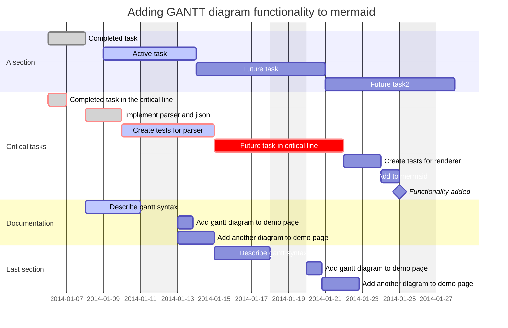

| 版本   | 时间        | 修改人 | 备注  |
|------|-----------|-----|-----|
| V1.0 | 2022.9.22 | 聂向南  | 初始化 |

## 1.需求背景

### 1.1.需求概述

> 相关PRD以及介

1. 需要支持图片上传，
2. 需要支持标题和内容多都可以传,标题可以为空，最多20个字，内容不能为，最多支持1000个字
3. 需要支持话题，话题可以支持搜索，搜索排序需要接入算法
4. 需要支持@用户功能，用户关联首先给用户关注的人和关注我的人，其次支持搜索
5. 需要支持自定义表情
6. 需要支持POI地点位置
7. 需要做权限设置，支持公开和私密两种
8. 支持定时发布功能

### 1.2.需求干系人

| 人员   | 项目角色 |
| ------ | -------- |
| 聂向南 | 研发     |

### 1.3.约束和限制

| 约束和限制 |                      条件                       |
| :--------: | :---------------------------------------------: |
|    时间    |                                                 |
|    成本    |                                                 |
|    安全    |               需要注意防资产损失                |
|    合规    |         敏感数据和隐私数据如何保证合规          |
|    技术    | 目前团队主要研发人员是 Java，最好用 Java 开发。 |
|    兼容    |          业务上需要历史老接口,需要兼容          |

### 1.4.技术目标

| 场景     | 目标       | 备注          |
|:-------|----------|-------------|
| 上传成功率  | 99.99%   | 依赖于对象存储的成功率 |
| 发布成功率  | 99.99%   |             |
| 发布时间耗时 | 95分位30分钟 |             |

### 1.5.术语

| 术语 | 定义 | 备注 |
|----|----|----|
|    |    |    |

## 2.需求分析

### 2.1.功能分析

#### 2.1.1.用例分析

整个需求在业务上一般有4个部分组成,分别是上传,管理,处理,分发.我们拿阿里的视频云链路流程举例

1. 上传,在设计上我们一般不接入他的SDK,通过自身的BUCKET来管理,在通过注册来完成媒体资料的信息
2. 需要支持通过PCWEB和客户端上传相关文件,并存储到相应的位置上来,我们接入的时候
3. 管理,需要对音视频和图片文件进行有效的管理,也可以对相关素材进行管理
4. 处理,需要对音视频&图片进行转码,以降低文件大小提升清晰度等,智能分类,视频截图，字幕挂载等操作
5. 分发,主要是内容对用户展示,其中主要是是安全和播放质量监控以及相关CDN辅助分发能力

#### 2.1.2.领域模型分析

> 可参考[C4_Model](https://c4model.com/)  使用C4-plantuml绘画,领域模型是系统的上下文,有助于系统边界设计，一般情况领域模型不变的情况下属于L1

 

1. 

### 2.2.技术分析

#### 2.2.1.可用性分析
1. 容量预估:
    1. 10亿注册用户,2亿DAU,人均发布50个帖子,其中90%的帖子是视频,单帖子15M,10%是图片,处理前图片300K,处理后单图片大概100K,人均10张图片,单帖子在3M左右，人均发布转化率在3%,人均日发送1.5个,视频大体时长在15S左右,大小在15 * 2Mbps/8=3.75M
    2. 我们预计当前帖子数在30亿,每日新增2亿* 0.03 *1.5=900W,按照1000W计算,未来预期容量10亿 * 50=500亿条,
2. 业务高可用,对于投稿应用来讲,是整个商业系统的核心,因此必须保证,文件上传的高可用,帖子写入的高可用,帖子存储的高可用,帖子读取的高可用.

#### 2.2.2.性能分析

1. 系统写入TPS预估:1000W/3600/24=115,峰值计算:1000W * 0.8/3600/24/0.2=462TPS,为了预留一定的系统容量应对峰值,将目标设定为峰值的5倍，462*5=2310TPS
2. 系统读取流量预估,峰值QPS整体按照10倍预估
   1. 首页帖子FEED流量预估,2亿* 6(一天打开6次)* 3(平均下查3个请求)/3600/24=41666，峰值=平均*10=41.7WQPS
   2. 用户在首页的跳出率是20%的话,其他业务流量41.7W*0.25=8.34W.下拉列表两次2次=8.34W *2=16.68W
   3. 因为是社区的基础数据业务,会被其他业务频繁的访问,因此需要预留和主场景一样的流量,41.7W.
   4. 因此41.7W+16.68W+41.7W=100W
3. 通过以上分析, 我们可以推断出投稿系统是个读多写少的业务.

#### 2.2.3.扩展性分析

>
可扩展性是指,系统为了应对将来需求变化而提供的一种扩展能力，当有新的需求出现时，系统不需要或者仅需要少量修改就可以支持，无须整个系统重构或者重建。由于软件系统固有的多变性，新的需求总会不断提出来，因此可扩展性显得尤其重要。在软件开发领域，面向对象思想的提出，就是为了解决可扩展性带来的问题；后来的设计模式，更是将可扩展性做到了极致。得益于设计模式的巨大影响力，几乎所有的技术人员对于可扩展性都特别重视。设计具备良好可扩展性的系统，有两个基本条件：正确预测变化,完美应对变化

1. 从内容的实际载体来看,业务现在支持图&视频,未来可能其他实体类型,比如只有音频因此需要支持其他业务实体的扩展,如只支持音频或其他
2. 针对除了内容本身外, 需要支持对内容的用户侧打标,如现有的话题,POI,权限,未来可能还要支持其他的打标能力
3. 在发布者端除了基础的运营能力,如置顶,未来还有可能出现合集等能力,

#### 2.3.4.成本分析

#### 2.2.5.其他

1. 212
2. 2121

 总体分析下来我们要重点考虑的点是高性能的帖子读取,高可用的文件上传,高可用的帖子发布,高可用的帖子存储,高可用的帖子读取,有安全的帖子发布.

## 3.技术选型

### 3.1 业务选型

1. 发送审核要不要放在媒体处理里
   1. 审核状态在投稿系统中是业务的一种，媒体处理例如转码也同样如此。
   2. 如果放在媒体处理工作流程中，会导致业务链路控制没有那么的顺畅，有一些业务的精确控制做不到。因此建议两者状态分开，由业务测来控制
2. 工具系统是否独立
   1. 在短视频场景下，视频剪辑场景是个非常重要的环节，决定了降低发布者的使用门槛，提升发布率
   2. 因此建议两者分开，两个团队分别关注的各自的业务指标，投稿团队关注发布成功率和处理耗时，工具团队关注视频发布数量和发布率以及各个环节的漏斗
3. 媒体处理是否独立
   1. 媒体处理牵涉到视频云PAAS和GPU机器和成本的管理等，同时是投稿团队重点关注的目标，因此不需要独立
4. 上传是否多云
   1. 多云相当于不绑定自己的技术路线，同时增强整个系统的稳定性,因此肯定是多云策略。
   2. 上传服务器是否需要自建，在多云的场景下，多套云都挂的概率比较低，短期不需要自建，长期看是否需要自建机房，若要自建机房可自建
5. 发布器上各自依赖组件如话题,POI等需要包装到投稿系统上吗
   1. 在发布器上一些功能组件是组成发布器的重要能力，但偏向底层基础能力，话题，POI是否可以像评论系统开放？这些随着业务的拓展，会慢慢的开放处理，因此建议由社区团队来整体负责。

### 3.2.数据库选型

#### 3.2.1.业务分析

1. 容量分析:当前帖子数在30亿,单条记录大概在1K左右,每日新增1000W,未来预期容量10亿 * 50=500亿条记录.
2. 性能分析:写入QPS 1W左右,查询一般时根据ID查询批量查询和根据用户ID按照时间线查询,若缓存命中率99%,600W*0.01=6W,若命中率降低到97%,需要支撑18W QPS,因此整体需要支持20W QPS

#### 3.2.1.Mysql

1. MySql一般原则,单表百万量级合适,单库百表量级别合适,这样数量级我们需要进行分库分表，若单表500W条,单库100张表记录,数量上大概有5亿,存储上大概有500G,我们现在需要500亿，因此需要100个库。
1. 拆分规则:整体拆分我们一般按照2的倍数来拆分,因此则按照用户ID取模来拆分,分为64库/128张表，500亿/64/128=710W条，一张表大概7G，128张表大概750G左右.
1. 成本:由于数据比较热的一般是10%的数据,所以数据库可以选32G,CPU选16核,基本单库支撑1WQPS不是问题,价格打个5折一般在1800左右,64库.价格大概在每月11W左右,1年成本大概=130W

#### 3.2.2.表格存储

1. 表格存储由于自带分库分表，自带分区键模式，因此不必考虑分库分表问题，同时支持宽表模式，可以快速支撑业务拓展.
2. 规则：主键也是分区键，同时需要提前做好相关分区，写入性能基本不受影响，读取性能需要走预留+弹性的模式来完成,同时需要创建e
3. 成本：

#### 3.2.3.选型

1. 整体看下来虽然Mysql成本上比较高，但可以同时提供更大量级别的QPS和TPS，同时外围生态比较完善，如DTS，多地域同步等能力，同时数据的迁移能力比较好，因此还是建议还是使用MYSQL.

### 3.3.缓存选型

#### 3.3.1 业务分析

1. 主要的查询场景是byIds查询,同时内容发布后修改的概率比较低但,因此在redis数据结构中我们一般使用String来存储.
2. 一天产生1000W条记录,数据库每条1K数据,我们经过序列化后大概512字节数据,如果缓存30天数据,需要1000W * 30 * 512/1024/1024/1024=142G数据。
3. 系统做为整个业务的基础服务,几乎所有的系统都要查询视频信息,我们的主查询场景只有根据用户ID查询自己发布过的帖子,根据ID列表查询基础数据,我们大体需要支撑100W的QPS,一次请求在6个左右,由于MEGT也是对不同的分片来访问，因此对于集群QPS在600W左右,现在我们部署在三个区域，所以大体的峰值在200W QPS左右.

#### 3.3.2.存储选型

> 相关介绍 https://help.aliyun.com/zh/tair/product-overview/overview

1. 存储介质:业务上我们需要对内容数据进行缓存,因此选择内存型.
2. 部署架构:我们需要支撑百万QPS峰值的和较大的存储压力，因此选择使用集群架构.
3. 容灾方案:我们的应用部署模型是同城异地且跨地域多region部署,但因为是缓存模式运用,因此不需要跨地域同步能力,只需要多可用区支撑就可以,因此我们选择同城容灾方案。
4. 内存规格:查询是一次6条记录，一次拉取6 * 0.5K=3K，200W * 3 K=5859M的带宽,在带宽上我们需要至少60个分片来支撑，同时redis容量一般维持在80%为好，按照142G来算，196G的内存总量比较接近，因此整体选择 2G,98分片的缓存部署在3个地域，一年价格在28.5W*3=85.5W

#### 3.3.3.更新一致性选型

1. 业务分析,数据可以被修改和删除,但修改后需要重新进行审核,删除后需要不可见到.审核期的内容不可被其他用户看到，但可以被自己看到。
2. 技术上更新模式一般分为主动更新模式和时被动更新模式。
   1. 主动点更新模式，在数据修改或者删除时我们在代码层面主动更新相关业务缓存或者失效相关缓存，这些会使得相关RT会增大,同时增大的业务的依赖.
   2. 被动更新模式，也就是CDC(变更数据捕获)模式,通过阿里云DTS来完成mysql的的数据变化,从而完成相关的更新和删除。
3. 由于内容需要审核后才能被看到，因此可以在这些审核的时间下，使用CDC模式来接耦架构,建议CDC模式
4. 成本上在数据订阅中一年的费用大概在7K左右

### 3.4.技术结论

1. 
2. 

## 4.详细设计

> 可参考[C4_Model](https://c4model.com/)  使用C4-plantuml绘画,在领域设计完成后基本达成一致,因此下面详细设计部分以应用视角来看

### 4.1.应用架构

> 以实际创建的应用为主的架构,重点是可单独运行的进程主要展示哪些逻辑放在哪个应用里,包含了服务端应用,客户端应用,数据库,文件系统,各种中间件等,如果没有新建应用,一般不会做大的改动

1. 整体内容生产可分为3大部分,分为投稿系统，投稿工具，转码系统,其中投稿系统核心分为3个应用,投稿应用，投稿服务和任务应用
2. 投稿应用属于对外暴露给网关系统，为前台应用提供服务，同时提供必要的检查能力。
3. 投稿服务和任务应用属于代码相同但部署不同的应用,这样可以使得应用异步任务分离，避免过多打扰线上业务,同时串联各个业务模块，如审核系统，消息系统等。

### 4.2.核心流程

> 该章节通过核心流程首先将组件图串联起来,以完成一个特定的任务,同时在叙述中延展该组件的所关注的业务和非功能设计要点

#### 4.2.1.上传

1. 高可用

2. 高性能

3. 可扩展

4. 安全

##### 4.2.1.1 时序

  

#### 4.2.2.投稿

1. 高可用

2. 高性能

3. 可扩展

4. 安全

##### 4.2.2.1 时序

#### 4.2.3.审核

1. 高可用

2. 高性能

3. 可扩展

4. 安全

##### 4.2.3.1 时序

#### 4.2.4.媒体处理

1. 高可用

2. 高性能

3. 可扩展

4. 安全

##### 4.2.4.1 时序

#### 4.2.4.查询

1. 高可用

2. 高性能

3. 可扩展

4. 安全

##### 4.2.1.1 时序

> 将组件,系统,应用串联起来使得可以完整的描述一个流程

### 4.3.存储设计

> 系统中数据库表如何设计,缓存如何设计,有哪些消息结构

#### 4.3.1.数据库设计

>  ER图

#### 4.3.2.缓存设计

> 缓存结构设计

1. 

### 4.4.部署架构

> 部署组件涉及到多region的部署视角,如果没有新增应用一般不会有很大的变化

## 5.横向概念

### 5.1.接口定义

> 需要引入其他文档,直接使用.proto文件,通过proto文件可快速生成对接文档

### 5.2.消息定义

> 该系统的相关消息定义

### 5.3.可运维定义

#### 5.3.1.动态配置

> MSE相关应用配置链接

#### 5.3.2.降级配置

> 降级系统配置链接

#### 5.3.3.预案配置

>预案配置链接

#### 5.3.4.机器人播报配置

> 机器人配置链接

### 5.4.数据及埋点

#### 5.4.1.技术埋点

> 缓存命中率埋点

#### 5.4.2.业务埋点

> 业务提出需求的埋点

## 6.排期规划

